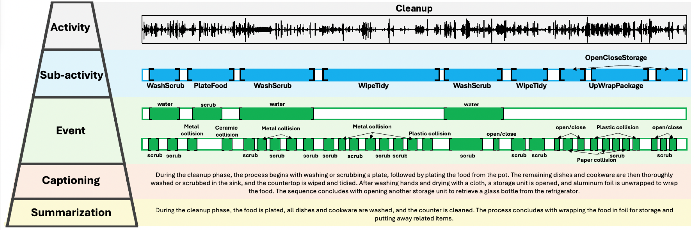

# Hierarchical Activity Recognition and Captioning from Long-Form Audio




## 1. Overview

MultiAct is a benchmark and framework for multi-level understanding of long-form human activities from audio, constructed from a curated subset of EPIC-SOUNDS recordings (derived from EPIC-KITCHENS), totaling **8.97 hours** of long-form kitchen audio reorganized into temporally contiguous activity segments with hierarchical annotations and multi-resolution captioning.

**MultiAct** introduces:
- Long-form audio recordings (up to 50 minutes)
- Hierarchical annotations at three semantic levels:
  - **Activity**: high-level procedural intent (e.g., *Cleanup*)
  - **Sub-activity**: mid-level actions (e.g., *WashScrub*, *WipeTidy*)
  - **Event**: fine-grained acoustic events (e.g., *scrub*, *metal collision*, *water*)
- Paired **fine-grained captions** and **high-level summaries**


**MultiAct** enables research on:
- Hierarchical activity recognition
- Temporal activity detection
- Sub-activity sequence prediction
- Multi-resolution audio captioning

## 2. Dataset Annotation Taxonomy

### 2.1 Activity Categories

| Activity | Description |
|----------|-------------|
| Prep     | Food and tool preparation before cooking, including handling ingredients, unwrapping, cutting, and seasoning. |
| Cook     | Heat-based cooking and food completion stages, including stove use, appliance operation, and plating. |
| Cleanup  | Post-cooking cleaning and tidying activities, such as washing dishes and wiping surfaces. |

---

### 2.2 Sub-activity Categories 

| Sub-activity        | Description |
|---------------------|-------------|
| HandleObject        | Moving, placing, or picking up objects. |
| OpenCloseStorage    | Opening or closing storage spaces or containers. |
| CutChop             | Cutting, slicing, grating, or chopping food. |
| SeasonFood          | Pouring or shaking sounds when adding seasonings. |
| MixKnead            | Stirring, mixing, kneading, or crushing food. |
| UnwrapPackage       | Unwrapping food packaging. |
| PreheatIgnite       | Igniting, preheating, or placing cookware on the stove. |
| PanCook             | Cooking with pans (e.g., frying, stir-frying, boiling), often accompanied by sizzling or boiling sounds. |
| ApplianceRunning    | Background noises from running kitchen appliances. |
| PlateFood           | Transferring cooked food from the pan to a plate or bowl. |
| WashScrub           | Washing with water or scrubbing to remove dirt. |
| WipeTidy            | Cleaning with minimal or no water, such as wiping surfaces or tidying items. |

---

### 2.3 Event Categories

MultiAct adopts the event-level taxonomy from the EPIC-SOUNDS dataset, which is derived from EPIC-KITCHENS.
The event annotations in MultiAct correspond to a subset of the original EPIC-SOUNDS sound event classes.

- **Number of event classes**: 44  
- **Source dataset**: EPIC-SOUNDS (a derivative of EPIC-KITCHENS)
- **Annotation granularity**: fine-grained acoustic events with temporal boundaries

MultiAct is constructed from a curated subset of EPIC-SOUNDS recordings, reorganized into long-form audio segments.
While MultiAct provides new hierarchical annotations and textual descriptions, the underlying event labels and audio data remain subject to the original EPIC-KITCHENS license.

## Baselines & Models

We provide baseline implementations for all tasks, including:

- **Feature Backbone**
- **Classification**
- **Detection**
- **Sequence Prediction**
- **Captioning**

## License

- **Annotations**: Creative Commons Attribution (CC BY)
- **Audio**: Subject to EPIC-KITCHENS Research License (non-commercial)

Please ensure you comply with the original EPIC-KITCHENS license when using the audio data.

## Acknowledgements

We thank collaborators and contributors from the EPIC-KITCHENS and EPIC-SOUNDS projects.  

## Citation

If you use MultiAct in your research, kindly reference:

```bibtex
@inproceedings{zhang2025multiact,
  title={Hierarchical Activity Recognition and Captioning from Long-Form Audio},
  author={Zhang, Peng and Luo, Qingyu and Jackson, Philip J.B. and Wang, Wenwu},
  booktitle={ICASSP},
  year={2026}
}